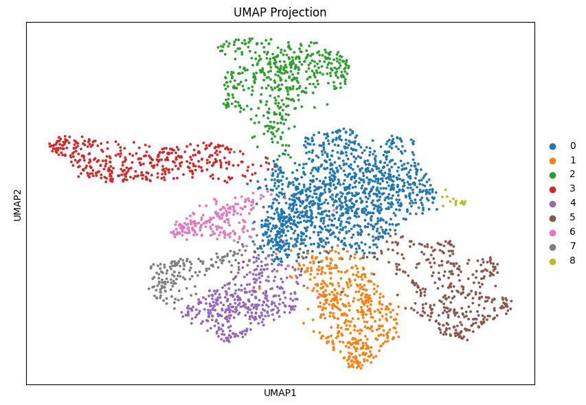
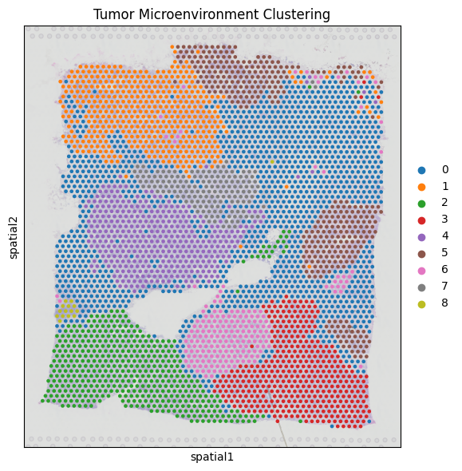

# 🧬 Spatial Transcriptomics Analysis Pipeline

[](https://www.python.org/)
[](https://scanpy.readthedocs.io/)
[](https://squidpy.readthedocs.io/)
[](LICENSE)

## Base study
- Mouse Brain Analysis: Histological structure and genetic implementation cluster similarity analysis with Mouse Brain dataset from 10x Genomics


- Tumor Microenvironment: genetic implementation difference analysis of tumor microenvironment with public cancer tissue ST data


## 📌 Introduction
This project aims to explore and analyze **Spatial Transcriptomics (ST)** data to uncover the spatial organization of gene expression within tissues. Leveraging the power of **Scanpy** and **Squidpy**, this repository contains an end-to-end pipeline for processing, clustering, and identifying spatially variable genes (SVGs) from 10x Genomics Visium datasets.

The goal is to bridge the gap between histology (morphology) and transcriptomics (gene expression) to understand tissue architecture at a molecular level.

## 🎯 Key Objectives
- **Preprocessing:** Quality control (QC) and normalization of spatial gene expression data.
- **Dimensionality Reduction:** Utilizing PCA and UMAP to visualize high-dimensional transcriptomic landscapes.
- **Spatial Clustering:** Identifying distinct tissue regions (spatial domains) using graph-based clustering (Leiden/Louvain).
- **Spatially Variable Genes (SVGs):** Detecting genes with distinct spatial patterns using Moran’s I statistic or spatial autocorrelation.
- **Visualization:** Integrating histology images with gene expression overlays.

## 📂 Dataset
* **Source:** [e.g., 10x Genomics Visium Public Dataset - Adult Mouse Brain]
* **Description:** This analysis uses the [Dataset Name] which contains [Number] spots and [Number] genes.
* **Note:** The raw data is not included in this repo due to size constraints. Please refer to `data/download_script.sh` to fetch the dataset.

## 🛠 Tech Stack & Methodology
This project demonstrates proficiency in **Bioinformatics** and **Data Science**:

* **Language:** Python
* **Core Libraries:**
    * `Scanpy`: Single-cell analysis framework.
    * `Squidpy`: Spatial omics analysis and visualization.
    * `Anndata`: Annotated data storage.
    * `Matplotlib` / `Seaborn`: Advanced visualization.
    * `Scikit-learn`: Machine learning utilities.

### Analysis Workflow
Please read [project workflow](./project-workflow.md)

## 📊 Sample Results

| UMAP Projection | Spatial Clustering |
|:---:|:---:|
|  |  |
| *Sequence clustering based on gene expression* | *Clusters mapped onto tissue image* |

> **Insight:** 

## 🚀 How to Run
```bash
# Clone the repository
git clone [https://github.com/sn0wsally/self-study-Spatial-Transcriptomics.git](https://github.com/sn0wsally/self-study-Spatial-Transcriptomics.git)

# Install dependencies
pip install -r requirements.txt

# Run the Jupyter Notebook
jupyter notebook notebooks/
