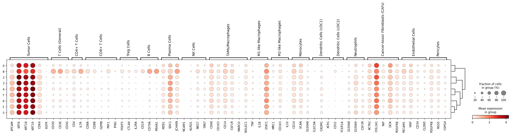

# 🧬 Clinical Validation & Cluster Mapping

This section uses Spatial Transcriptomics analysis result (**Unsupervised Clusters(Leiden)**) to map the clusters to the actual Clinical Terminology and theoretically validate the mapping.

### 📋 Global Standardized Gene Marker Table

| TME Cell Type/State                     | Representative Marker Genes                                  |
|----------------------------------------|--------------------------------------------------------------|
| Tumor Cells                            | EPCAM, KRT8, KRT18, KRT19 (Epithelial), CDK4, EGFR           |
| T Cells (General)                      | CD3D, CD3E, CD3G                                             |
| CD4+ T Cells                           | CD4, IL7R                                                    |
| CD8+ T Cells                           | CD8A, CD8B, GZMB, PRF1, IFNG                                 |
| Treg Cells                             | FOXP3, CTLA4, IL2RA (CD25)                                   |
| B Cells                                | CD19, CD79A, MS4A1 (CD20)                                    |
| Plasma Cells                           | MZB1, SDC1 (CD138), JCHAIN                                   |
| NK Cells                               | NCAM1 (CD56), KLRD1, NKG7, GNLY                              |
| TAMs/Macrophages                       | CD68, CD163, CD14, CSF1R, MARCO, SIGLEC1                     |
| M1-like Macrophages                    | NOS2, TNF, IL1B, STAT1                                       |
| M2-like Macrophages                    | MRC1 (CD206), ARG1, CD163, IL10                              |
| Monocytes                              | CD14, VCAN, S100A8                                           |
| Dendritic Cells (cDC1)                 | CLEC9A, CADM1, XCR1                                          |
| Dendritic Cells (cDC2)                 | CD1C, FCER1A                                                 |
| Neutrophils                            | S100A8, S100A9, CSF3R, ELANE                                 |
| Cancer-Assoc Fibroblasts (CAFs)        | ACTA2 (α-SMA), COL1A1, FAP, DCN, PDGFRB                      |
| Endothelial Cells                      | PECAM1 (CD31), VWF, CD34, CLDN5                              |
| Pericytes                              | PDGFRB, RGS5, CSPG4                                          |

Based on the table above, a dictionary was formed and filtered as using the list of genes that are actually present in the data.
This provides cluster mapping to actual clinical label;

#### Scanpy dotplot

Accordingly, the cluster : cell result is
| Cluster | Cell | Reason (Description) |
|---------|------|----------------------|
|  0  |  Stroma  |  |
|  1~7 | Tumor |  |
|  8  |  Immune Cells  |  |

Since the clustering from cluster 0 to cluster 8 is based on the spot, not by cells, this end up as such label mapping.
---

### 🔍 Validation Strategy

---

### 🛠 Refined Dataset Status (Noise Cleansing)
